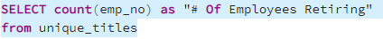

# Analysis of a Company's Employee Records and Retirement Eligibiltiy Using SQL

## Overview

At the company's request, this analysis conducts a deep dive in to their personnel records. After the data is provided, the database is constructed
by making a number of tables to hold all relevant data. High level queries are then conducted using SQL to do a deep dive on the retirement eligibility of the employees. In addition, a query is conducted to determine which employees are eliigible to become mentors for the process of onboarding new employees. Afterwards, it is apparent there are some serious concerns regarding the number of employees close to retirement and how the company plans to fill these positions.

## Resources

- Tools: PostgreSQL, pgAdmin
- Software: SQL, Visual Studio Code 1.38.1

## Results & Summary

Number of roles which need to be filled as the "silver Tsunami" (mass retirings) begin to take place:

Number of qualified, retirement-ready employees in the departments to mentor onboarding employees:

Four key takeaways:
1. 
2. 
3. 
4. 
