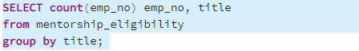

# Analysis of a Company's Employee Records and Retirement Eligibiltiy Using SQL

## Overview

At the company's request, this analysis conducts a deep dive in to their personnel records. After the data is provided, the database is constructed
by making a number of tables to hold all relevant data. High level queries are then conducted using SQL to analyze the retirement eligibility of the employees with respect to their titles and departments. In addition, a query is conducted to determine which employees are eligible to become mentors for the process of onboarding new employees. Afterwards, it is apparent there are some serious concerns regarding the number of employees close to retirement and how the company plans to fill these positions.

## Resources

- Tools: PostgreSQL, pgAdmin
- Software: SQL, Visual Studio Code 1.38.1

## Results & Summary

Number of roles which need to be filled as the "silver Tsunami" (mass retirings) begin to take place:

As per the above query, 72,458 employees are eligible to retire which will trigger the "silver tsunami"

As per the above query, the 72,458 reitrement-eligible employees are grouped by their respective departments. 

Number of qualified, retirement-ready employees in the departments to mentor onboarding employees:

It is not known how many employees a single "mentor" can work with, but it is clear that more mentors will be needed. 1,549 mentors for 72,458 retiring employees does not seem sufficient.

Four key takeaways:

 1. There is a very large amount of employees nearing retirement (approx. 72,458).

 2. There are only 2 employees in the position of "Manager" who are eligible to retire.

 3. A majority of the retirement-eligible employees are Senior Staff/Senior Engineers. They make up approx. 70% of the retirement pool. 

 4. Due to the large amount of Senior level employees retiring there will need to be a large amount of promotional opportunites for the lower level staff/engineers to help fill those senior positions. Outside hiring may need to take place for the senior positions as well. 